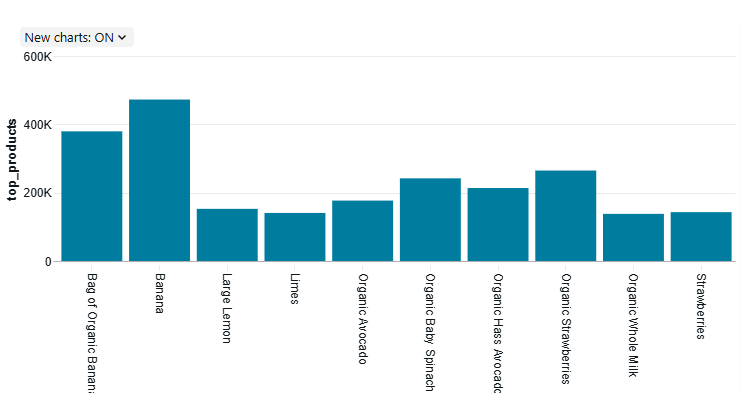
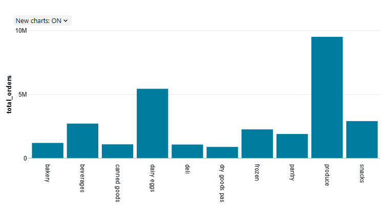
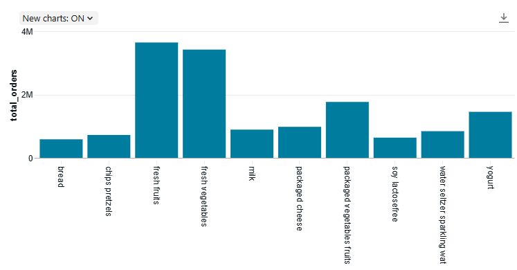
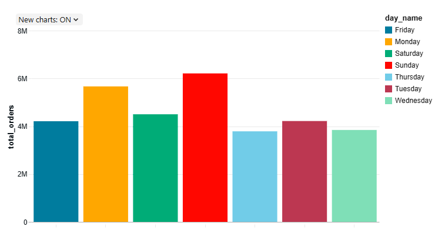
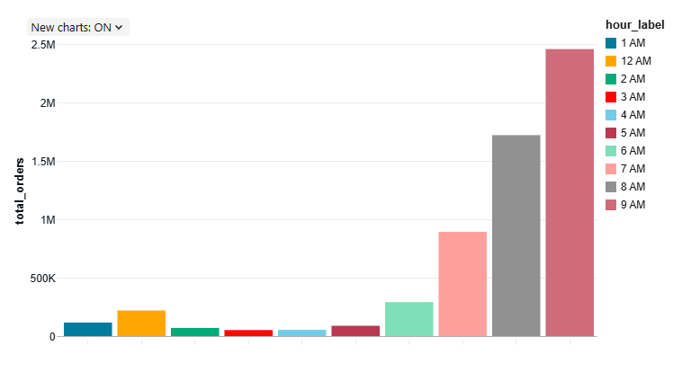
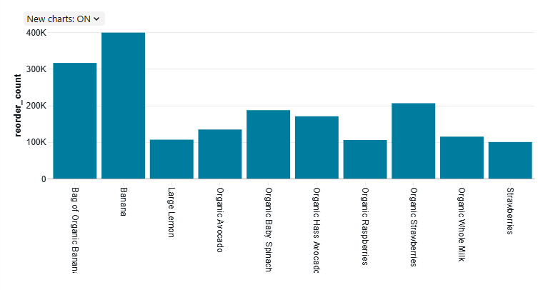
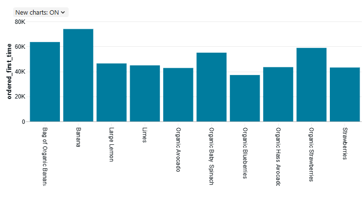

# 🛒 E-Commerce Data Engineering Pipeline (Medallion Architecture)

## 📌 Project Overview

This project implements a complete **Data Engineering pipeline** using the **Medallion Architecture (Bronze → Silver → Gold)** in Databricks.

The goal is to transform raw e-commerce data into meaningful business insights using PySpark.

---

## 🎯 Problem Statement

E-commerce platforms generate large volumes of raw data (orders, products, users).
This data is not directly usable for analysis.

👉 This project:

* Cleans and processes raw data
* Builds structured datasets
* Generates business insights

---

## 🏗️ Architecture

Bronze → Silver → Gold

* **Bronze Layer**: Raw data ingestion (CSV → Parquet)
* **Silver Layer**: Data cleaning, joins, transformations
* **Gold Layer**: Aggregations and business insights

---

## ⚙️ Tech Stack

* **Databricks (Serverless)**
* **PySpark**
* **Parquet Format**
* **Unity Catalog (Volumes)**

---

## 📥 Dataset

The dataset used in this project is sourced from Kaggle (Instacart Market Basket Analysis).

- Full dataset is not included due to size
- Sample dataset is available in `data/sample/`

Dataset link:
https://www.kaggle.com/datasets/psparks/instacart-market-basket-analysis


## 📂 Project Structure

The project follows a structured layout separating notebooks and visualization outputs:
  
```
ecommerce-data-engineering-project/
│
├── notebooks/
│   ├── 01_bronze_ingestion.py
│   ├── 02_silver_transformations.py
│   └── 03_gold_aggregations.py
│
├── data/
│   └── sample/
│       ├── orders_sample.csv
│       ├── order_products_sample.csv
│       ├── products_sample.csv
│       ├── aisles_sample.csv
│       └── departments_sample.csv
│
├── output_screenshots/
│   ├── top_products/
│   │   ├── chart.png
│   │   └── table.png
│   │
│   ├── department_sales/
│   │   ├── chart.png
│   │   └── table.png
│   │
│   ├── aisle_sales/
│   │   ├── chart.png
│   │   └── table.png
│   │
│   ├── orders_by_day/
│   │   ├── chart.png
│   │   └── table.png
│   │
│   ├── orders_by_hour/
│   │   ├── chart.png
│   │   └── table.png
│   │
│   ├── reorder_rate/
│   │   ├── chart.png
│   │   └── table.png
│   │
│   ├── top_reordered_products/
│   │   ├── chart.png
│   │   └── table.png
│   │
│   └── top_first_time_products/
│       ├── chart.png
│       └── table.png
│
├── requirements.txt
├── .gitignore
└── README.md

```

## 🔄 Data Pipeline

### 🥉 Bronze Layer

* Ingest raw CSV data
* Store as Parquet
* No transformations

### 🥈 Silver Layer

* Data cleaning (handled invalid values like *"Blunted", "Red"*)
* Data type corrections
* Joins across datasets
* Final cleaned dataset

### 🥇 Gold Layer

* Business-level aggregations:

  * Top Products
  * Department Sales
  * Aisle Sales
  * Orders by Day
  * Orders by Hour
  * Reorder Analysis

---

## 📊 Key Insights

---

### 🔝 Top Products



Shows the most frequently ordered products. These products have the highest demand and contribute significantly to overall sales.

---

### 🏬 Department Sales



Highlights which departments generate the most orders. This helps identify high-performing categories in the business.

---

### 🛒 Aisle Sales



Provides a more granular view of product categories within departments, helping analyze customer preferences at aisle level.

---

### 🔁 Reorder Rate


Indicates the proportion of reordered products. A higher reorder rate suggests strong customer retention and product satisfaction.

---

### 🗓️ Orders by Day



Shows how orders are distributed across different days of the week, helping identify peak shopping days.

---

### ⏰ Orders by Hour



Displays customer activity throughout the day. Typically, peak ordering hours occur during daytime or evening.

---

### 🔄 Top Reordered Products



Shows products that are most frequently reordered, indicating strong customer loyalty and repeat demand.

---

### 🆕 Top First-Time Ordered Products



Represents products that are commonly purchased for the first time, helping identify popular entry-point items for customers.

---


## 💡 Key Learnings

* Built end-to-end data pipeline using Medallion Architecture
* Handled real-world dirty data issues
* Implemented scalable transformations using PySpark
* Created business insights from raw data

---

## 🚀 Conclusion

This project demonstrates how raw data can be transformed into actionable insights using a structured data engineering approach.

---

## 👤 Author

**Mohammed Nayeem Uddin**
